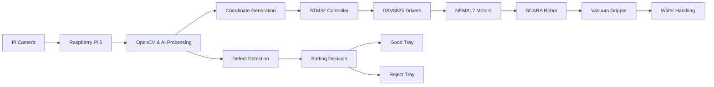
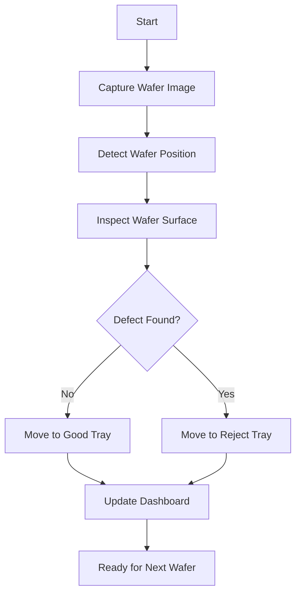

# VisionPick SCARA

## 1. Project Overview

VisionPick SCARA is an AI-powered autonomous robotic system designed for semiconductor wafer handling, inspection, and defect sorting. The project combines SCARA robotics, computer vision, embedded systems, and industrial automation to create a smart manufacturing solution inspired by real semiconductor production environments.

The system uses a Raspberry Pi 5 and Pi Camera to detect wafers, identify their position, and inspect them for defects using image processing techniques. The detected coordinates are sent to an STM32 microcontroller, which precisely controls the movement of a SCARA robotic arm. A vacuum gripper picks the wafer and places it into either a Good Tray or Reject Tray based on the inspection results.

### Target Users

* Semiconductor Manufacturing Industry
* Industrial Automation Engineers
* Robotics Researchers
* Embedded Systems Developers
* Engineering Students

### Purpose

* Automate wafer handling operations
* Reduce contamination and handling errors
* Improve inspection accuracy
* Demonstrate Industry 4.0 concepts
* Provide a low-cost semiconductor automation prototype

---

# 2. Technical Architecture

## System Architecture



## Operational Flow



---

# 3. Technologies Used

## Computer Vision & AI

* OpenCV
* Image Processing
* Machine Vision
* Edge AI

## Embedded Systems

* STM32
* Raspberry Pi

## Robotics

* SCARA Robot Kinematics
* Stepper Motor Control
* Vacuum Pick-and-Place

## Communication

* UART Serial Communication

## Programming Languages

* Python
* C
* C++

## Development Tools

* VS Code
* STM32CubeIDE
* Git
* GitHub

---

# 4. Hardware Components

## Silicon Labs Hardware (Optional Enhancement)

* EFR32BG22 Bluetooth Module
* Si7021 Temperature & Humidity Sensor
* Si7210 Hall Effect Sensor

## Main Hardware

### Processing Units

* Raspberry Pi 5
* STM32F103C8T6

### Vision System

* Raspberry Pi Camera Module 3

### Motion System

* NEMA17 Stepper Motors ×3
* DRV8825 Drivers ×3

### Mechanical Components

* Aluminum Profile Frame
* SCARA Arm Links
* Base Plate
* Linear Guide Rail
* Lead Screw & Nut
* 608ZZ Bearings

### End Effector

* Mini Vacuum Pump
* Vacuum Suction Cup
* Silicone Air Tube

### Sensors

* Limit Switches
* IR Sensors
* Vacuum Pressure Sensor (Optional)

### Power System

* 12V 5A SMPS
* 5V Buck Converter

---

# 5. External Hardware

* HDMI Touchscreen Display (Optional)
* USB Keyboard
* USB Mouse
* Logic Analyzer (Optional)
* Digital Multimeter
* Oscilloscope (Optional)
* Laptop for Development

---

# 6. Software Components / Dependencies

## Silicon Labs Dependencies (Optional)

### Gecko SDK

* Gecko SDK Suite (Latest Stable Release)

### Simplicity Studio

* Simplicity Studio 5

---

## Raspberry Pi Dependencies

### Operating System

* Raspberry Pi OS

### Python Libraries

* OpenCV
* NumPy
* PySerial
* Tkinter / PyQt

Example:

```bash
pip install opencv-python
pip install numpy
pip install pyserial
```

---

## STM32 Dependencies

* STM32CubeIDE
* HAL Drivers
* CMSIS Libraries

---

# 7. Contributing

Contributions are welcome.

Please follow the CONTRIBUTING guidelines before submitting pull requests.

Areas of contribution include:

* Motion Control Optimization
* Defect Detection Algorithms
* Mechanical Design Improvements
* User Interface Enhancements
* Industrial Communication Protocols

---

# 8. Code of Conduct

Please follow the Code of Conduct while participating in this project.

Respectful and professional collaboration is expected from all contributors.

---

# 9. License

This project is licensed under the MIT License.

See LICENSE.md for details.

---

# 10. Maintainers / Contacts

| Name                   | Role                        | Contact Information                                         | GitHub Profile                             |
| ---------------------- | --------------------------- | ----------------------------------------------------------- | ------------------------------------------ |
| Abhishek Seth          | Project Lead                | abhishek.seth_ec23@gla.ac.in                                | https://github.com/Abhishek05eccs          |
| Adarsh Kishor Singh    | Embedded Systems            | adarsh.singh_ec23@gla.ac.in                                 | https://github.com/adarshsinghec23-sys     |
| Deepti Sehgal          | Robotics & control Systems  | deepti.sehgal_ec23@gla.ac.in                                | https://github.com/deeptisehgalec23-hub    |
| Harshit Tiwari         | Computer Vision             | harshit.tiwari_ec23@gla.ac.in                               | https://github.com/harshittiwariec23-coder |
| Dr. Anjan Kumar        | Mentor                      | anjan.kumar@gla.ac.in                                       | N/A                                        |
---
